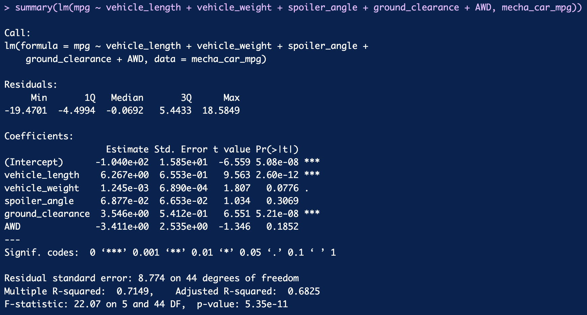
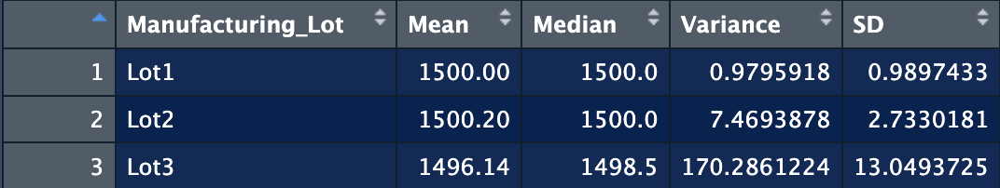
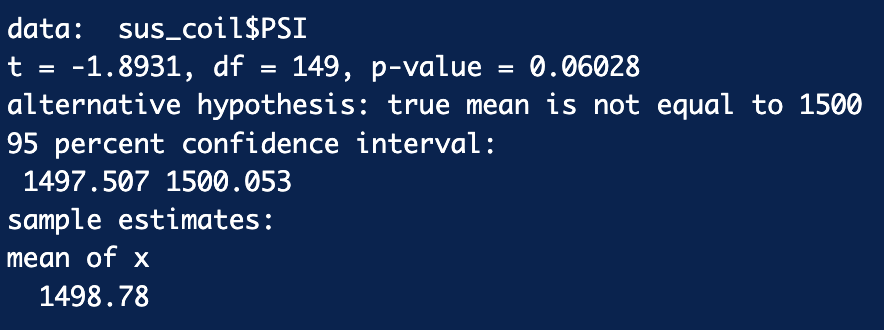
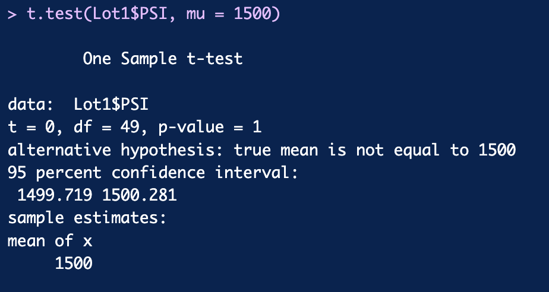
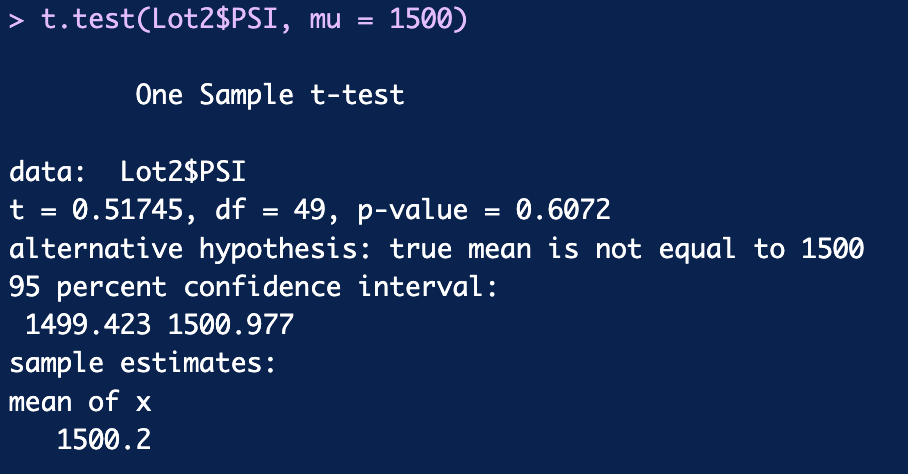
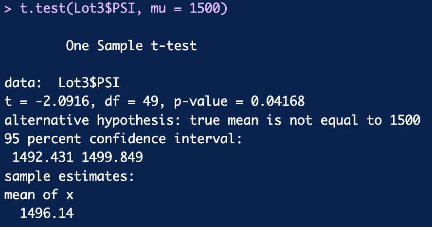

# MechaCar Statistical Analysis

### Project Overview

The purpose of this project is to analyze the metrics that affect the production of new car prototypes and to compare vehicle performance between batches from different manufacturers. These metrics include vehicle length, weight, spoiler angle, ride height, AWD capability, MPG, and PSI. 

#### Linear Regression to Predict MPG

- Non-random variables usually have a variance of 0. Given this fact, it can be said that intersection factors, vehicle length, and ground clearance provide a non-random amount of variance in mpg values.
- At the 0.05 significance level, the p-value is so small that you can reject the null hypothesis. The null hypothesis for linear regression is that the slope (β1) equals 0. However, if we reject the null hypothesis, we can say that the alternative hypothesis (β1 ≠ 0) is true. This proves that the slope is non-zero.
- The multiple R-squared increases as more variables run the regression. However, the adjusted coefficient of determination control adjusts for this increase and adds a penalty to the number of predictors in the model, resulting in a more accurate predictor of linear model effectiveness. An adjusted R-squared of 0.6825 concludes that this linear model is fairly good at predicting the mpg of the MechaCar prototype. 

___

#### Summary Statistics on Suspension Coils

The total variance across the dataset shows that the current manufacturing data satisfies the 100 pounds per square inch variance constraint. However, when split into 3 lots, the 3rd lot shows a much higher variance. Because slots are randomly selected, it is possible that one-third of lots will not meet the required suspension coils requirements.

___

### T-Test on Suspension Coils

#### T-Test on Entire Lot
At the 0.05 significance level, we do not reject the null hypothesis because the p-value is 0.06. Therefore, we cannot ignore the fact that the sample mean may be equal to the true population mean. Another notable feature is the narrow confidence intervals. A narrower confidence interval is less likely to give an observation within that interval but is more accurate than a wider confidence interval. 

#### T-Test on Three Smaller Lots

##### Test of Lot 1
 At the 0.05 significance level, the p-value is 1, so we do not reject the null hypothesis. An interesting correlation between p-values ​​and confidence intervals is that the confidence interval decreases as the p-value increases. This means that the true population mean will be better predicted. 

##### Test of Lot 2
At the 0.05 significance level, the p-value is 0.6072, so we again do not reject the null hypothesis. The confidence interval for the second lot is also relatively small. 

##### Test of Lot 3
At the 0.05 significance level, the p-value is 0.04168, so you can reject the null hypothesis. The average value for this sample is also significantly lower compared to the previous two batches. More importantly, unlike the previous two lots, the confidence interval for the third lot does not include the predicted population mean. 

___
## Study Design: MechaCar vs Competition

Another statistical study that can be performed to determine MechaCar's position relative to its competitors is a linear regression of city and highway fuel efficiency. Gasoline is expensive these days and is a key feature that many consumers look for when purchasing a new vehicle. The metrics that can be included in this analysis are:

Fuel Economy City and Highway: dependent variable
- Horsepower: independent variable
- Vehicle weight: independent variable
- AWD Features: independent variable
- MPG: Independent Variables In addition to his MPG, AWD, and vehicle weight data, which he already has, I need to collect fuel efficiency and horsepower data for the sample dataset I have. 